# Monitoring crop growing status

**Figure 1.** Administrative boundary.

In Lebanon, where diverse climatic zones and varied topography greatly influence agricultural practices, monitoring crop growth is essential. The country's distinct geographical features create unique microclimates that impact vegetation and crop cycles. Regular observation of crop growth not only informs agricultural management but also aids in understanding and adapting to environmental changes [1]. This monitoring is crucial for sustaining Lebanon's rich biodiversity, supporting its agricultural economy, and managing land resources effectively. By keeping a close eye on crop conditions, Lebanon can ensure food security, optimize resource use, and maintain ecological balance.

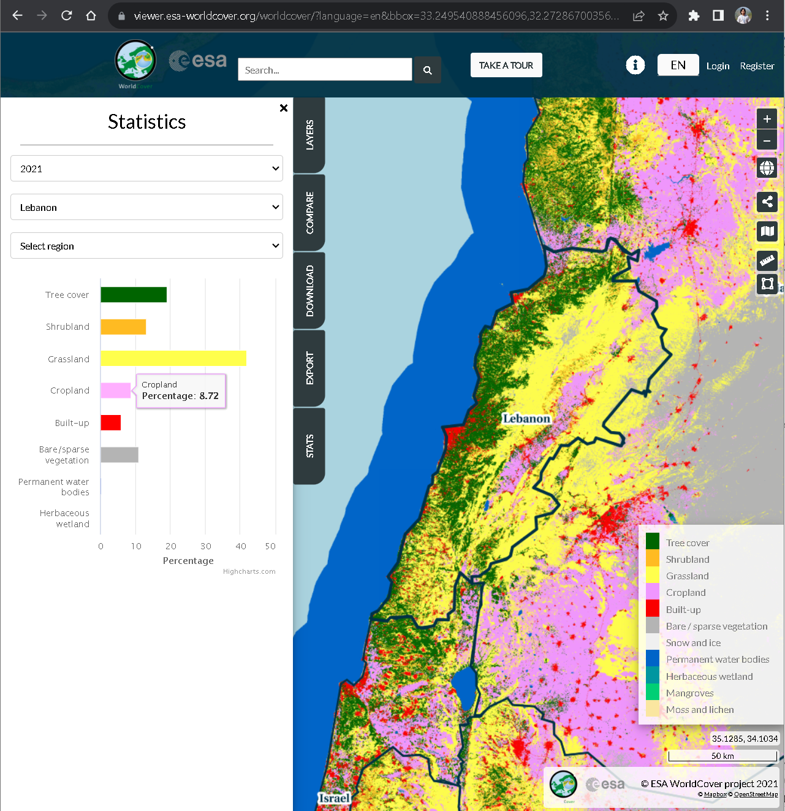

**Figure 2.** Land cover.

Remote sensing techniques have revolutionized vegetation monitoring. Tools like the Moderate Resolution Imaging Spectroradiometer ([MODIS](https://modis.gsfc.nasa.gov/about/)) Terra ([MOD13Q1](https://lpdaac.usgs.gov/products/mod13q1v061/)) and Aqua ([MYD13Q1](https://lpdaac.usgs.gov/products/myd13q1v061/)) Vegetation Indices 16-day L3 Global 250m time series data allow for comprehensive analysis of vegetation conditions. By deriving variables such as standardized anomaly and vegetation condition index, we can quantify vegetation changes over time and across different regions [2].

Consistent monitoring of crop growth in Lebanon brings a multitude of benefits. It facilitates the early identification and management of agricultural challenges such as land degradation, as well as the tracking of crop health, crucial for informed agricultural decision-making [3]. This process is vital in guiding policymakers to develop strategies and environmental policies tailored to Lebanon's unique landscape and agricultural needs, promoting a sustainable future for the nation and its people.

In Lebanon, where agriculture is a cornerstone of the economy and essential for food security, a comprehensive understanding of crop growth patterns is indispensable. Utilizing phenological analysis through data from sources like MODIS MOD13Q1 and MYD13Q1, we can gain precise and up-to-date insights into crop development stages. This information is critical for enhancing agricultural management, optimizing resource distribution, and bolstering the resilience of the farming sector [4].

To achieve this, the [TIMESAT](https://web.nateko.lu.se/timesat/timesat.asp) software, specializing in time series data analysis, is employed to extract vital phenological parameters, such as the Start of Season (SOS) and End of Season (EOS), from Vegetation Index (VI) data. By concentrating this analysis on the crop-growing regions of Lebanon, we ensure that the insights are highly relevant and applicable to local agricultural conditions [5].

This detailed phenological data empowers Lebanese farmers and agricultural stakeholders to make well-informed decisions about critical farming activities, including planting, irrigation, and harvesting schedules. It also aids in anticipating and addressing potential risks to crop health and yield, such as diseases, pests, or the impacts of climate variability. Integrating this phenological perspective into broader crop monitoring initiatives offers a thorough and practical understanding of the factors influencing agricultural productivity and environmental health in Lebanon.

## Data

In this exercise, we utilize various high-quality datasets to analyze vegetation conditions and phenology within Lebanon's cropland areas. The Data section introduces the sources of information used, setting the stage for the methodologies and results discussed later in the exercise. Our analysis incorporates VI data from the MOD13Q1 and MYD13Q1 products and the cropland extent provided by the ESA WorldCover 2021 dataset. This combination allows for a nuanced assessment of Lebanon's agricultural landscape, enhancing our understanding of factors that influence agricultural productivity and environmental sustainability in the country.

### Crop extent

With only about 8.72 percent of Lebanon's total land area dedicated to agriculture, the effective monitoring and management of these croplands are paramount. This relatively small portion of agricultural land necessitates meticulous stewardship to ensure maximum productivity and sustainable practices. Focused attention on these areas is essential for optimizing land utilization, contributing significantly to national food security and the agricultural economy. Such dedicated management is key to maintaining a balance between achieving high agricultural yields and preserving Lebanon's natural ecosystems.

**Figure 3.** Cropland

We used the new [ESA World Cover](https://esa-worldcover.org/en) map 10m LULC to mask out areas which aren't of interest in computing the EVI, i.e. built-up, water, forest, etc. The cropland class has value equal to 40, which will be used within Google Earth Engine ([GEE](https://earthengine.google.com/)) to generate the mask. 

There are many ways to download the WorldCover, as explained in the WorldCover [Data Access](https://esa-worldcover.org/en/data-access) page.

### Vegetation Indices

The EVI from both MOD13Q1 and MYD13Q1 downloaded using GEE which involves some process:

 * Combine the two 16-day composites into a synthethic 8-day composite containing data from both Aqua and Terra.

 * Applying Quality Control Bitmask, keep only pixels with good quality.

 * Applying cropland mask, keep only pixels identified as a cropland based on ESA WorldCover.

 * Clipped for Lebanon and batch export the collection to Google Drive.

**Figure 4.** Vegetation indices, September 2023.

### Climate

Understanding the dynamics of crop growth and development in Lebanon requires a comprehensive approach that includes the analysis of climate data. Monthly temperature and rainfall patterns are pivotal factors influencing agricultural cycles. By integrating time-series data of these climate parameters into our analysis, we can gain deeper insights into how environmental conditions affect crop growth.

Temperature and rainfall are key drivers of phenological stages such as germination, flowering, and maturation. For instance, variations in monthly temperatures can significantly impact the growth rate and health of crops. Warmer temperatures may accelerate growth in certain crops but can also increase evapotranspiration and water demand. On the other hand, cooler temperatures might slow down growth or even damage sensitive crops.

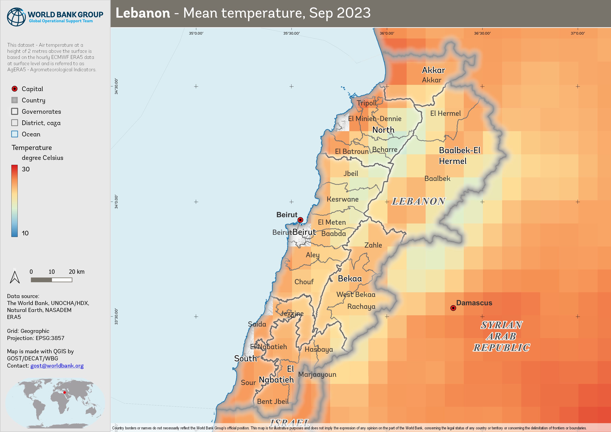

**Figure 5.** Mean temperature, September 2023.

Similarly, rainfall patterns play a crucial role in determining water availability for crops. Adequate rainfall is essential for crop survival and productivity, but excessive or insufficient rainfall can lead to adverse conditions like flooding or drought, respectively.

**Figure 6.** Accumulated rainfall, September 2023.

By analyzing these climate data alongside vegetation indices and phenological information, we can correlate climate trends with vegetation dynamics. 

Monthly temperature derived from [ERA5-Land](https://doi.org/10.24381/cds.68d2bb30), and rainfall data come from [CHRIPS](https://www.chc.ucsb.edu/data/chirps).

## Limitations and Assumptions

Getting VI data with good quality for all period are challenging (pixels covered with cloud, snow/ice, aerosol quantity, shadow) for optic data (MODIS). Cultivated area year by year are varies, due to MODIS data quality and crop type is not described, so the seasonal parameters are for general cropland. 

At this point, the analysis is also limited to seasonal crops due to difficulty to capture the dynamics of perennial crops within a year. The value may not represent for smaller cropland and presented result are only based upon the most current available remote sensing data. As the climate phenomena is a dynamic situation, the current realities may differ from what is depicted in this document.

Ground check is necessary to ensure if satellite and field situation data are corresponding.

## General approach

We present a summary of the key derived variables employed in our analysis to monitor vegetation conditions and crop growing stages within Lebanon's cropland areas. These variables, which are derived from the EVI data and the cropland extent, enable a comprehensive understanding of the factors influencing agricultural productivity and environmental sustainability in the region.

### Vegetation-derived anomaly

We focuses on analyzing various EVI derived products, such as the standardized anomaly and Vegetation Condition Index (VCI). These derived products provide valuable insights into vegetation health, vigor, and responses to environmental factors like climate change and land-use practices. By examining the EVI-derived products, we can assess vegetation dynamics and identify patterns and trends that may impact ecosystems and human livelihoods.

**Standardized Anomaly**

The standardized anomaly is a dimensionless measure that accounts for variations in the mean and standard deviation of the time series data, allowing for a more robust comparison of anomalies across different regions or time periods. This variable can help identify abnormal vegetation conditions that may warrant further analysis or management action.

The anomaly is calculated based on difference from the average and standard deviation

`"anomaly (%)" = ("evi" - "mean_evi") / "std_evi"`

where `evi` is current EVI and `mean_evi` and `std_evi` is the long-term average and standard deviation of EVI.

**Vegetation Condition Index (VCI)**

The Vegetation Condition Index (VCI) is a normalized index calculated from the Enhanced Vegetation Index (EVI) data, which ranges from 0 to 100, with higher values indicating better vegetation health. By providing a concise measure of the overall vegetation condition, the VCI enables the identification of trends and patterns in vegetation dynamics and the evaluation of the effectiveness of management interventions.

To calculate the VCI, the current EVI value is compared to its long-term minimum and maximum values using the following equation:

`"vci" = 100 * ("evi" - "min_evi") / ("max_evi" - "min_evi")`

where `evi` is current EVI and `min_evi` and `max_evi` is the long-term minimum and maximum of EVI.

### Phenological Metrics

A working example to detect seasonality parameters in Lebanon has been developed based on areas where the majority is a cropland. This approach requires a crop type mask and moderate resolution time series Vegetation Indices (VI). 

State of planting and harvesting estimates are determined by importing Vegetation Indices (VI) data into TIMESAT – an open-source program to analyze time-series satellite sensor data. TIMESAT conducts pixel-by-pixel classification of satellite images to determine whether planting has started or not. This process is followed for all areas over multiple years to evaluate current planting vis-à-vis historical values from 2003 - 2023.

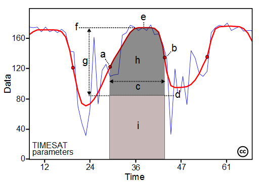

**Figure 7.** TIMESAT Parameters

The main seasonality parameters generated in TIMESAT are (a) beginning of season, (b) end of season, (c) length of season, (d) base value, (e) time of middle of season, (f) maximum value, (g) amplitude, (h) small integrated value, (h+i) large integrated value. The blue line in Figure 11 shows the raw EVI time series, while the red line shows the EVI values after applying a Savitsky-Golay smoothing algorithm. The phenological parameters detected describe key aspects of the timing of agricultural production and are closely related to the amount of available biomass.

The image below shows a fluctuating trend in the Vegetation Index over time. Green and red dots are used to mark the start and end of the growing seasons, respectively which can be useful for understanding patterns in vegetation growth.

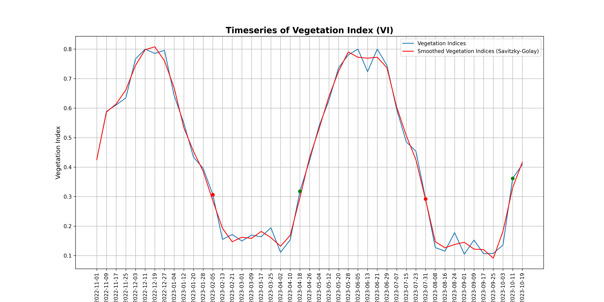

**Figure 8.** Fluctuating trend in the VI values over time

The next image is a heatmap that provides a visual representation of the Vegetation Index (VI) values over time and still related with above image. Each cell in the heatmap corresponds to a specific date, and the color of the cell represents the VI value on that date, with lighter colors indicating lower VI values and darker colors indicating higher VI values. This heatmap, along with the line graph, can be used to monitor the growing stages of cropland. By comparing the two images, one can observe how the VI values change over time and identify the start and end of the growing seasons. This information can be crucial for farmers and agricultural scientists for planning and optimizing crop growth. 

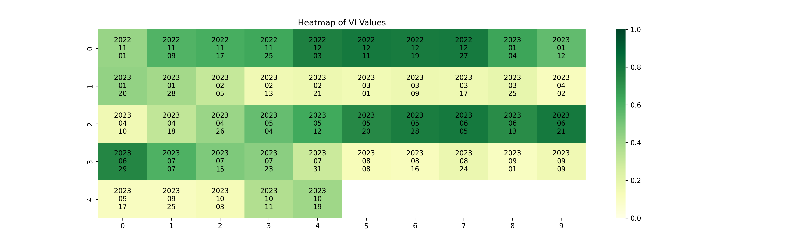

**Figure 9.** Heatmap that provides a visual representation of the VI values over time

The Start of Season (SOS) and End of Season (EOS) are typically derived from VI data. These metrics are calculated using various methods that identify critical points or thresholds in the vegetation index time series data. One common approach is the Timesat software, which fits functions (e.g., logistic, asymmetric Gaussian, Savitsky-Golay, Whittaker) to the time series data to identify these points. Here's a general overview of the approach:

1. **Preprocessing:** Detrend and smooth the vegetation index time series data to reduce noise.

2. **Model Fitting:** Fit a function (e.g., logistic, asymmetric Gaussian) to the smoothed time series data. The chosen function should adequately represent the seasonal pattern of vegetation growth and senescence.

3. **Threshold Determination:** Define thresholds for SOS and EOS. These thresholds may be absolute values, or they may be based on a percentage of the maximum vegetation index value for the season (e.g., 20% for SOS and EOS).

4. **Metric Calculation:** Identify the points in the fitted function where the thresholds are met. These points correspond to the SOS and EOS.

	* **SOS:** The time step where the fitted function first exceeds the lower threshold, marking the start of significant vegetation growth.

	* **EOS:** The time step where the fitted function falls below the lower threshold again, signifying the end of significant vegetation growth.

Note that these metrics will depend on the choice of function, thresholds, and other methodological details. The equations for calculating SOS and EOS may vary depending on the specific technique employed.

## Result

We present a summary of the key derived variables employed in our analysis to monitor vegetation conditions and dynamics within Lebanon's cropland areas. 

### Anomaly and Vegetation Condition

These variables, which are derived from the EVI data and the cropland extent, enable a comprehensive understanding of the factors influencing agricultural productivity and environmental sustainability in the region.

::::{tab-set}
:::{tab-item} Standardized Anomaly, Sep 2023

**Figure 10.** Standardized anomaly, September 2023, compared to the reference 2003-2022
:::

:::{tab-item} Standardized Anomaly, Jul-Sep 2023

**Figure 11.** Standardized anomaly, July-September 2023, compared to the reference 2003-2022
:::

:::{tab-item} Vegetation Condition Index, Sep 2023

**Figure 12.** Vegetation Condition Index, September 2023, compared to the reference 2003-2022
:::

:::{tab-item} Vegetation Condition Index, Jul-Sep 2023

**Figure 13.** Vegetation Condition Index, July-September 2023, compared to the reference 2003-2022
:::
::::

And below is the vegetation condition for the last 3 quarter.

::::{tab-set}
:::{tab-item} Standardized Anomaly, Q1-Q3 2023
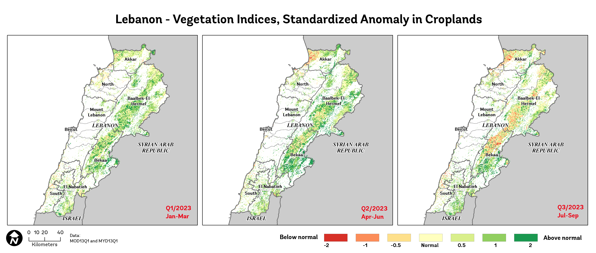

**Figure 14.** Standardized anomaly, Q1-Q3, compared to the reference 2003-2022
:::

:::{tab-item} Vegetation Condition Index, Q1-Q3 2023
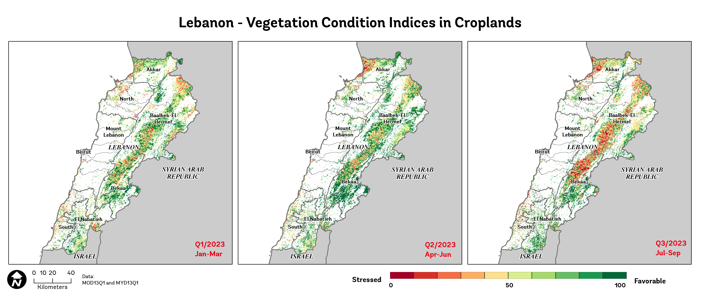

**Figure 15.** Vegetation Condition Index, Q1-Q3 2023, compared to the reference 2003-2022
:::
::::

### Crop Growing Stages

In addition to the previously mentioned vegetation indices and derived products, this study also focuses on analyzing key phenological metrics, such as the Start of Season (SOS), Mid of Season (MOS), and End of Season (EOS). These metrics provide essential information on the timing and progression of the growing season, offering valuable insights into plant growth and development. By examining SOS, MOS, and EOS, we can assess the impacts of environmental factors, such as climate change and land-use practices, on vegetation dynamics. Furthermore, understanding these phenological patterns can help inform agricultural management strategies, conservation efforts, and policies for sustainable resource management.

**Start of Season (SOS)**

The SOS is a critical phenological metric that represents the onset of the growing season. By analyzing the timing of SOS, we can gain insights into how environmental factors, such as temperature and precipitation, impact vegetation growth and development. Understanding the SOS is vital for agricultural planning, as it can inform planting and harvesting schedules, irrigation management, and help predict potential yield outcomes.

**Figure 16.** Start of Season, Jan - Sep 2023

**End of Season (EOS)**

The EOS is an important phenological marker signifying the conclusion of the growing season. Investigating the timing of EOS can reveal valuable information about the duration of the growing season and the overall performance of vegetation. EOS trends can help us understand how factors such as temperature, precipitation, and human-induced land-use changes impact ecosystems and their productivity. Information on EOS is also crucial for agricultural management, as it aids in planning harvest schedules and post-harvest activities, and supports the development of informed land management and conservation policies.

**Figure 17.** End of Season, Jan - Sep 2023

## Supporting Evidence and Visual Insights

This section offers a comprehensive visual exploration of agricultural activities, emphasizing the spatial and temporal dynamics of cultivation in Lebanon. This chapter presents a series of maps and charts that elucidate the extent of cultivated areas in comparison to historical crop extents, as well as the patterns and timelines of crop planting and harvesting on both monthly and annual scales.

Our analysis includes a historical perspective, showcasing the changes in agricultural practices over three distinct periods: 2011-2015, 2016-2020, and 2021-2023. This temporal segmentation allows us to observe trends and shifts in agricultural activities, providing insights into how external factors like climate change, policy shifts, and economic conditions may have influenced farming practices over the last decade.

The visualizations are presented at both the national level and the administrative level 1 (admin1), offering a broad overview as well as more localized insights. While our data extends to admin3 level, allowing for detailed, granular analysis, the focus on higher administrative levels ensures clarity and accessibility in understanding the broader trends and patterns.

Key features of this section include:

1. **Comparative Maps of Cultivation Extent:** These maps compare the actual cultivated areas with the historical extents of crops, highlighting regions of expansion or reduction in agricultural land use.

2. **Visualization of Agricultural Changes:** The use of maps to visualize agricultural data across different time periods, aiding in the identification of spatial patterns and regional differences in agricultural activities.

3. **Temporal Aggregation of Crop Cycles and Climate:** Charts that aggregate planting and harvesting data on monthly and annual bases and the trend of rainfall and temperature over the area, providing a clear view of the agricultural calendar and its variations over the years.

4. **Analysis of Planting and Harvesting Trends:** An examination of how the timing of planting and harvesting deviates from historical averages, offering insights into the evolving nature of agricultural practices in response to various influencing factors.

This section serves as a valuable supplement to the primary results, offering an enriched perspective on the state and evolution of agriculture in Lebanon. It is intended to support researchers, policymakers, and stakeholders in understanding the complex dynamics of agricultural land use and management.

### Comparative Maps of Cultivation Extent

The analysis encompasses a detailed examination of the annual cultivated land in Lebanon over three distinct periods: 2011-2015, 2016-2020, and 2021-2023. These comparative maps provide a visual representation of the temporal changes in agricultural practices, focusing on both planting and harvest phases.

**Planting Phase Analysis (2011-2023):** The map for this period reveals the spatial distribution and extent of land preparation and planting activities. It helps in understanding the initial stages of agricultural cycles and how they have evolved over time.

::::{tab-set}
:::{tab-item} 2011-2015
:sync: key1
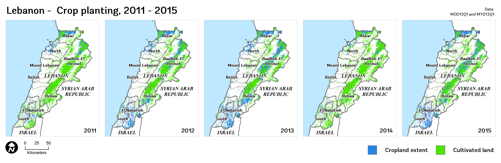

**Figure 18.** Cultivated land, 2011-2015
:::

:::{tab-item} 2016-2020
:sync: key2
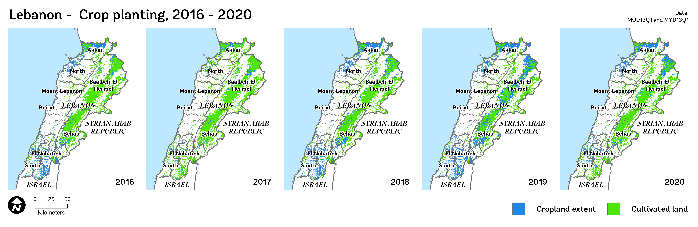

**Figure 19.** Cultivated land, 2016-2020
:::

:::{tab-item} 2021-2023
:sync: key3
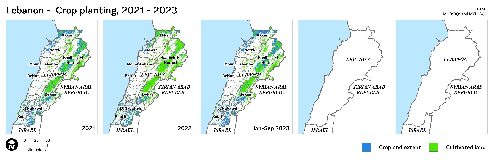

**Figure 20.** Cultivated land, 2021-2023
:::
::::

**Harvest Phase Analysis (2011-2023):** This map illustrates the areas where harvesting activities were predominant, offering insights into the culmination of agricultural cycles. It aids in assessing the productivity and end results of farming practices during this period.

::::{tab-set}
:::{tab-item} 2011-2015
:sync: key1
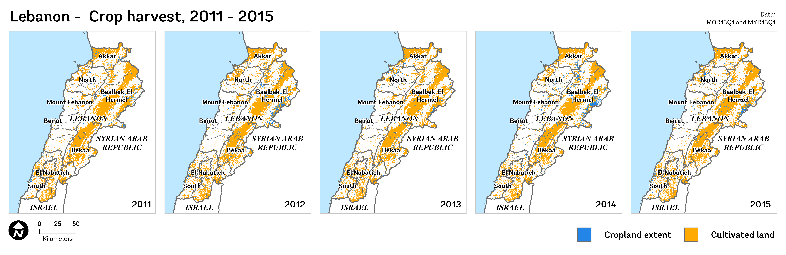

**Figure 21.** Cultivated land, 2011-2015
:::

:::{tab-item} 2016-2020
:sync: key2
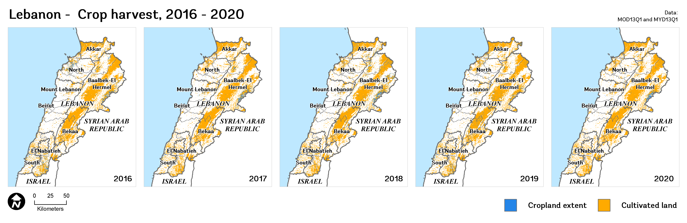

**Figure 22.** Cultivated land, 2016-2020
:::

:::{tab-item} 2021-2023
:sync: key3
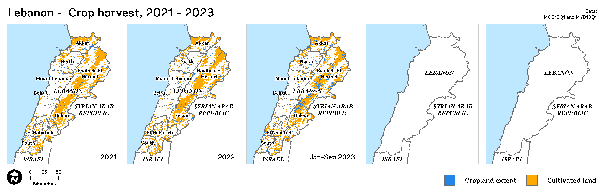

**Figure 23.** Cultivated land, 2021-2023
:::
::::

### Visualization of Agricultural Changes: Trends and Anomalies in Planting and Harvest

This section delves into the annual trends and anomalies in planting and harvest areas across Lebanon for the periods 2011-2015, 2016-2020, and 2021-2023, with a particular focus on the admin3 level. By examining these trends, we gain a nuanced understanding of how agricultural activities have evolved over time in specific regions.

**Annual Trends in Planting and Harvest Areas:** These visualizations showcase the yearly fluctuations in the extent of cultivated lands during the planting and harvesting phases. They reveal patterns, consistencies, or irregularities in agricultural practices across different regions, providing insights into the stability and adaptability of the agricultural sector.

* Planting areas

	::::{tab-set}
	:::{tab-item} 2011-2015
	:sync: key1
	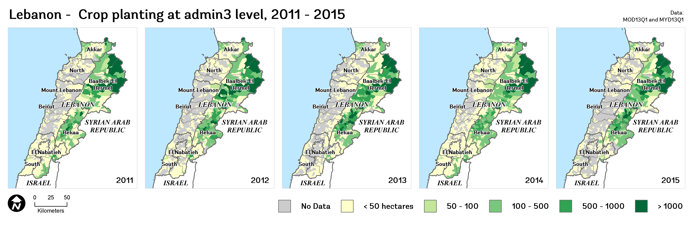

	**Figure 24.** Planting areas, 2011-2015
	:::

	:::{tab-item} 2016-2020
	:sync: key2
	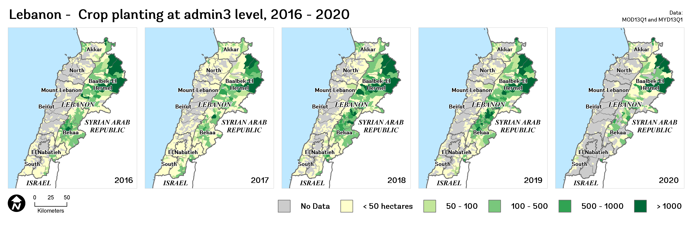

	**Figure 25.** Planting areas, 2016-2020
	:::

	:::{tab-item} 2021-2023
	:sync: key3
	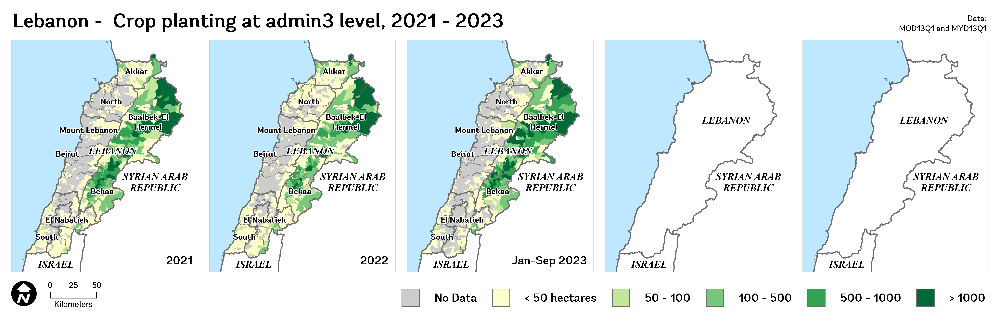

	**Figure 26.** Planting areas, 2021-2023
	:::

* Harvest areas

	:::{tab-item} 2011-2015
	:sync: key1
	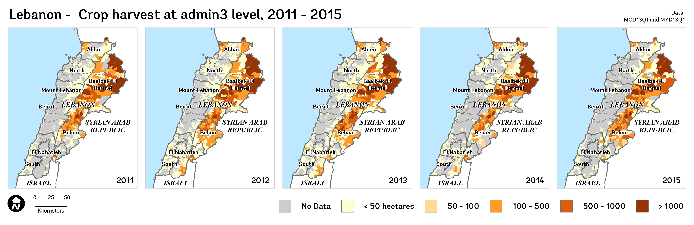

	**Figure 27.** Harvest areas, 2011-2015
	:::

	:::{tab-item} 2016-2020
	:sync: key2
	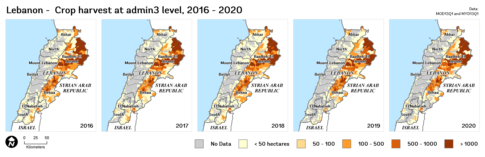

	**Figure 28.** Harvest areas, 2016-2020
	:::

	:::{tab-item} 2021-2023
	:sync: key3
	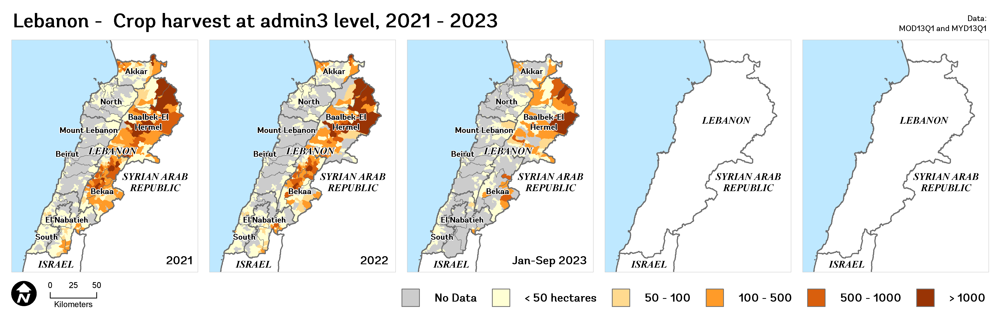

	**Figure 29.** Harvest areas, 2021-2023
	:::
	::::

**Percent Anomalies in Planting and Harvest Areas:** The analysis of anomalies offers a deeper perspective on the deviations from expected or average agricultural activities. By highlighting regions with significant deviations, these charts help in identifying areas that may be experiencing changes due to environmental factors, policy shifts, or other influences.

* Planting anomaly

	::::{tab-set}
	:::{tab-item} 2011-2015
	:sync: key1
	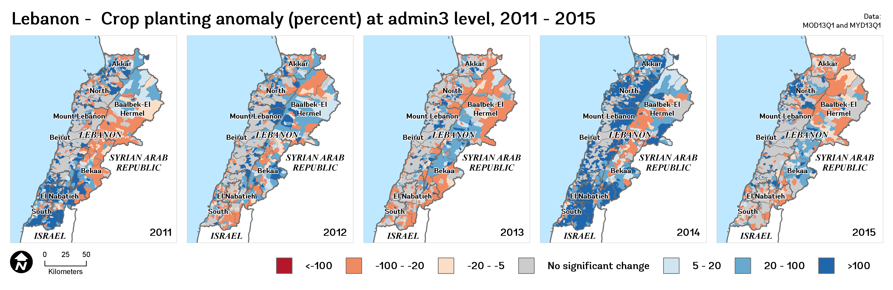

	**Figure 30.** Planting anomaly, 2011-2015
	:::

	:::{tab-item} 2016-2020
	:sync: key2
	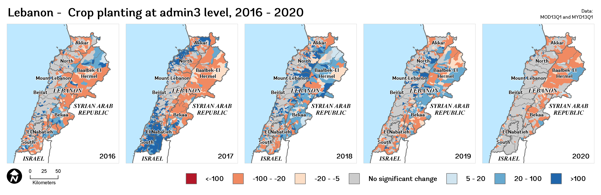

	**Figure 31.** Planting anomaly, 2016-2020
	:::

	:::{tab-item} 2021-2023
	:sync: key3
	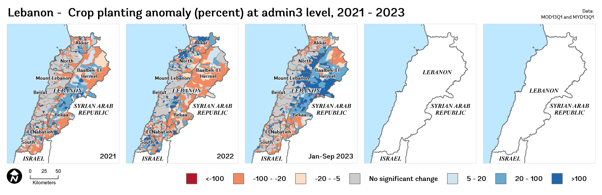

	**Figure 32.** Planting anomaly, 2021-2023
	:::

* Harvest anomaly

	:::{tab-item} 2011-2015
	:sync: key1
	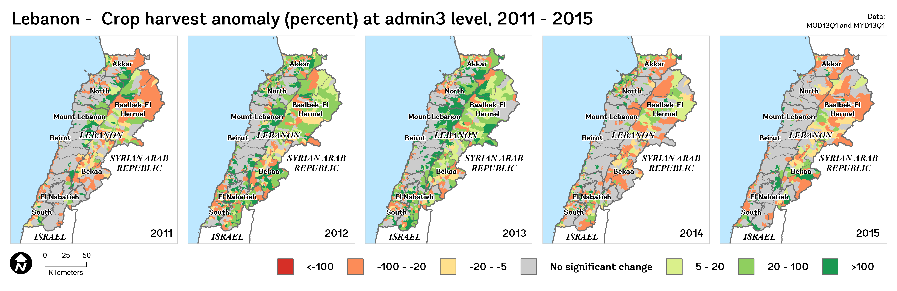

	**Figure 33.** Harvest anomaly, 2011-2015
	:::

	:::{tab-item} 2016-2020
	:sync: key2
	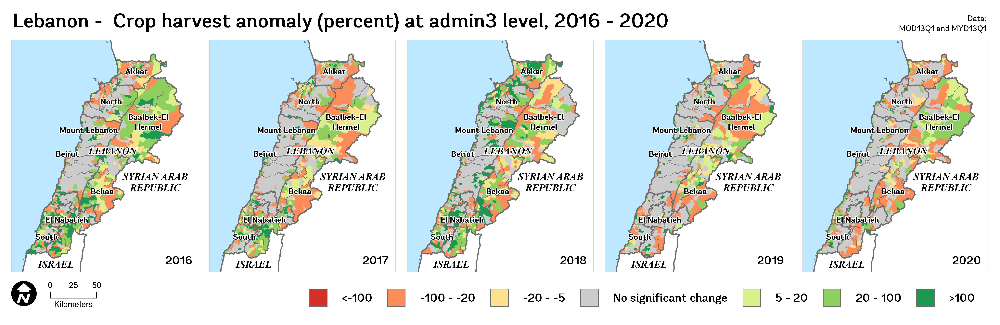

	**Figure 34.** Harvest anomaly, 2016-2020
	:::

	:::{tab-item} 2021-2023
	:sync: key3
	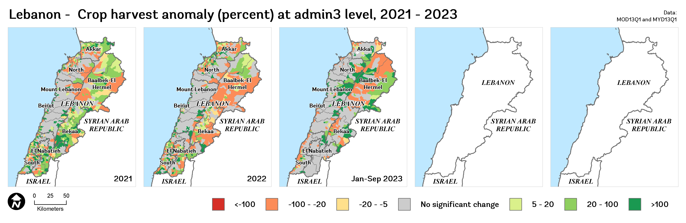

	**Figure 35.** Harvest anomaly, 2021-2023
	:::
	::::

### Temporal Aggregation of Crop Cycles and Climate: A Multi-Level Analysis

This section presents a comprehensive analysis of planting and harvest cycles in conjunction with climate data, spanning from 2003 to 2023. The focus is on both national (admin0) and governorate (admin1) levels, offering a layered understanding of agricultural patterns in relation to environmental factors.

**Annual and Monthly Planting and Harvest Trends:** Line plots illustrate the fluctuations in the areas of planting and harvest throughout the years. These visualizations trace the seasonal and annual variations, providing a clear picture of the agricultural calendar and its evolution over the past two decades.

* National aggregate

	::::{tab-set}
	:::{tab-item} Annual Harvest and Planting
	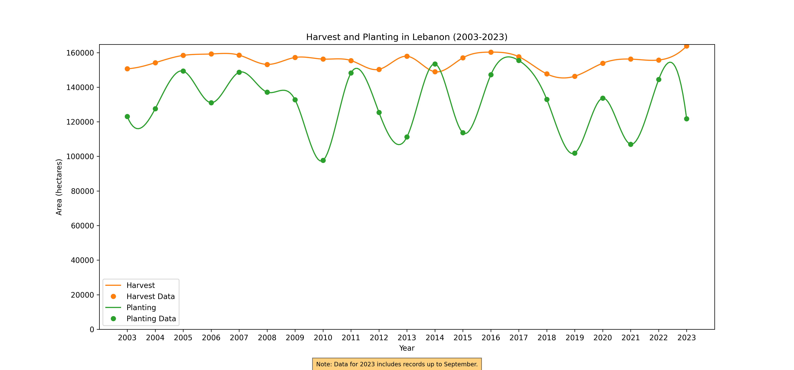

	**Figure 36.** Annual Harvest and Planting, 2003-2023
	:::

	:::{tab-item} Monthly Harvest and Planting
	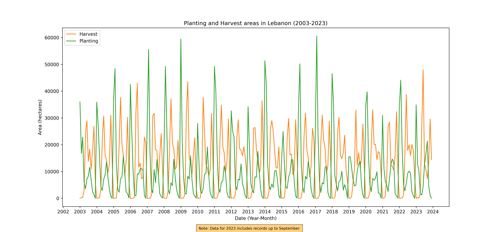

	**Figure 37.** Monthly Harvest and Planting, 2003-2023
	:::
	::::

* Governorate aggregate

	* Annual Harvest and Planning

		::::{tab-set}
		:::{tab-item} Beirut
		:sync: key1
		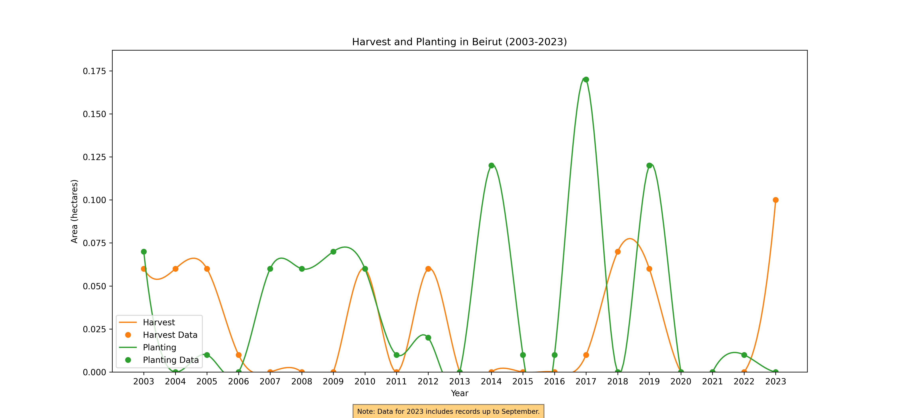

		**Figure 38.** Annual Harvest and Planting, 2003-2023
		:::

		:::{tab-item} Bekaa
		:sync: key2
		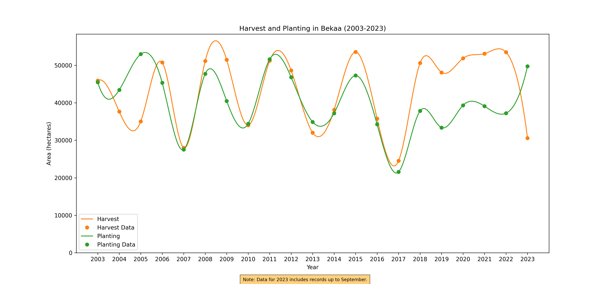

		**Figure 39.** Annual Harvest and Planting, 2003-2023
		:::

		:::{tab-item} Mount Lebanon
		:sync: key3
		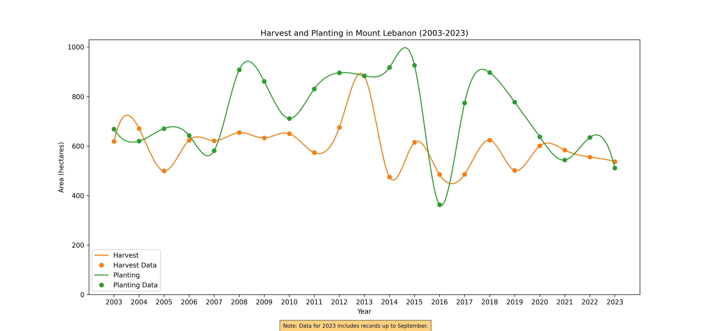

		**Figure 40.** Annual Harvest and Planting, 2003-2023
		:::

		:::{tab-item} El Nabatieh
		:sync: key4
		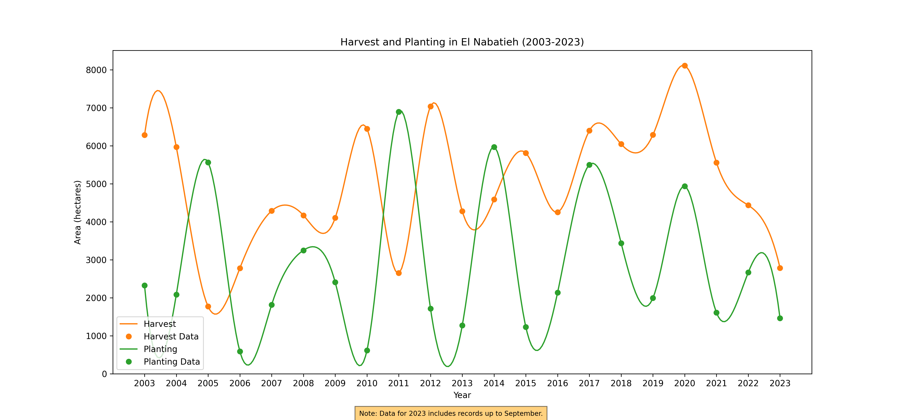

		**Figure 41.** Annual Harvest and Planting, 2003-2023
		:::

		:::{tab-item} North
		:sync: key5
		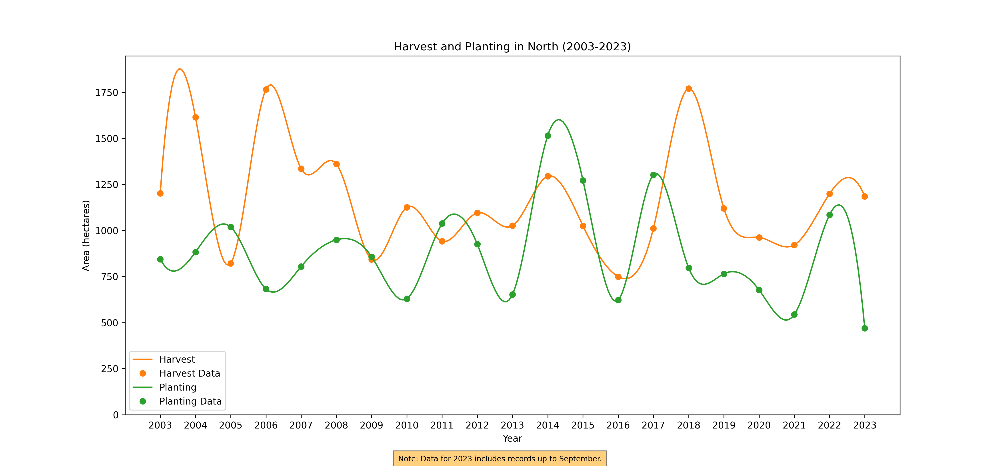

		**Figure 42.** Annual Harvest and Planting, 2003-2023
		:::

		:::{tab-item} South
		:sync: key6
		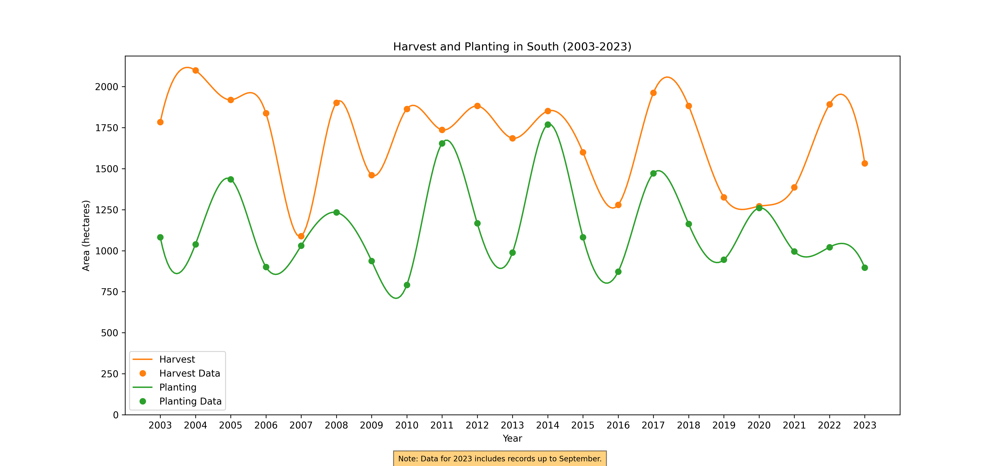

		**Figure 43.** Annual Harvest and Planting, 2003-2023
		:::

		:::{tab-item} Akkar
		:sync: key7
		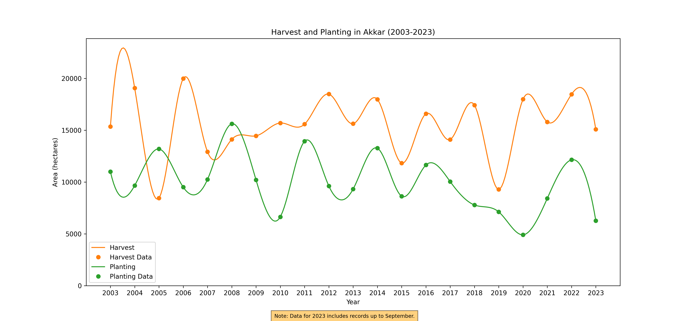

		**Figure 44.** Annual Harvest and Planting, 2003-2023
		:::

		:::{tab-item} Baalbek-El Hermel
		:sync: key8
		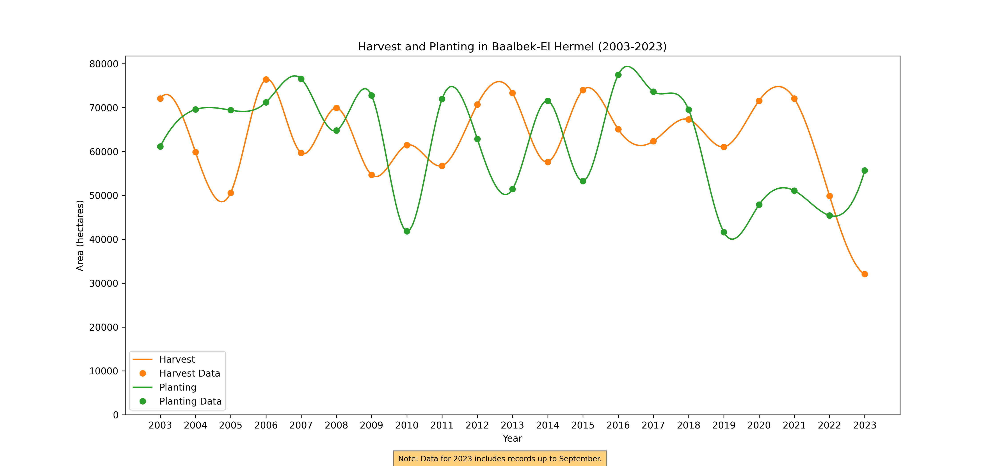

		**Figure 45.** Annual Harvest and Planting, 2003-2023
		:::
		::::

	* Monthly Harvest and Planning

		::::{tab-set}
		:::{tab-item} Beirut
		:sync: key1
		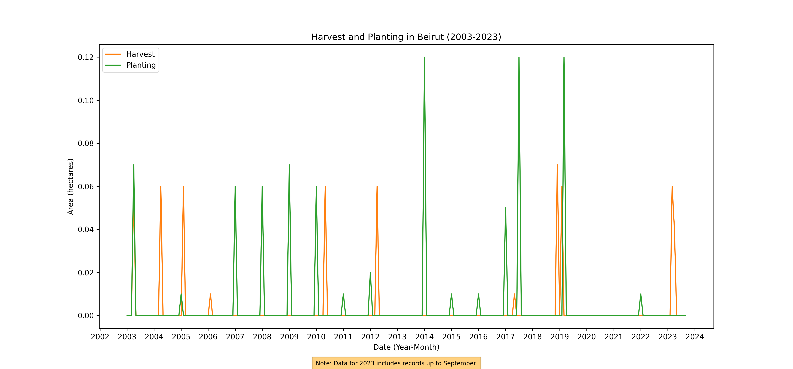

		**Figure 46.** Monthly Harvest and Planting, 2003-2023
		:::
		
		:::{tab-item} Bekaa
		:sync: key2
		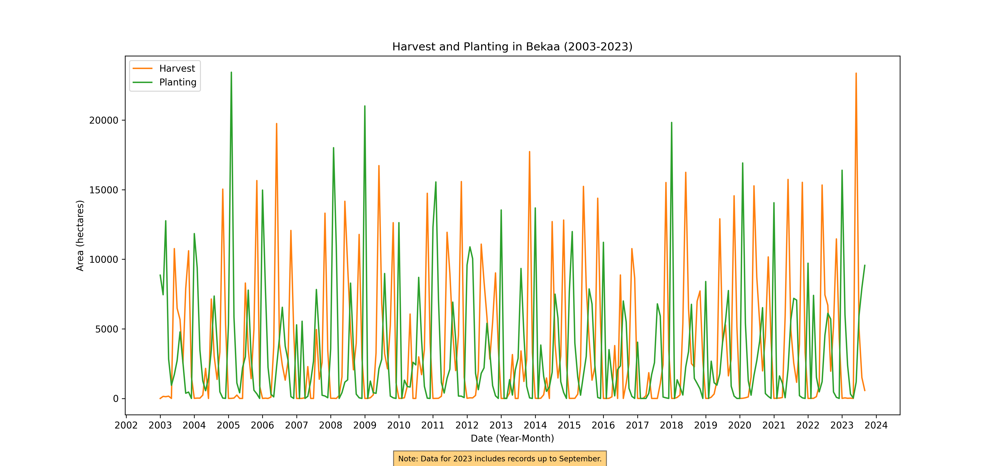

		**Figure 47.** Monthly Harvest and Planting, 2003-2023
		:::
		
		:::{tab-item} Mount Lebanon
		:sync: key3
		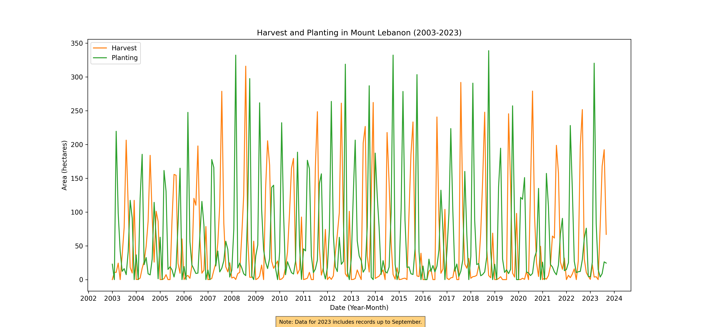

		**Figure 48.** Monthly Harvest and Planting, 2003-2023
		:::
		
		:::{tab-item} El Nabatieh
		:sync: key4
		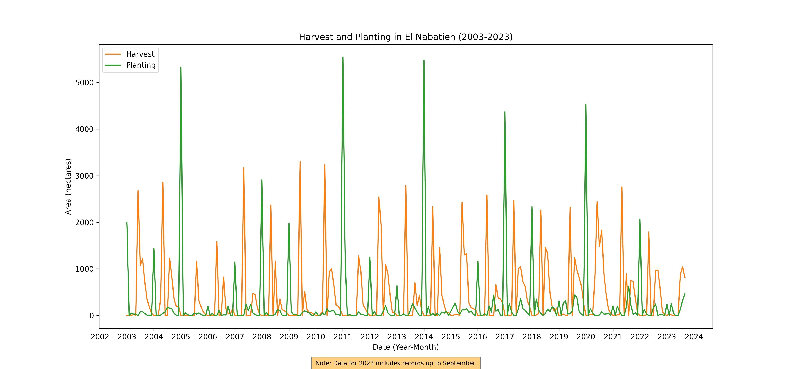

		**Figure 49.** Monthly Harvest and Planting, 2003-2023
		:::
		
		:::{tab-item} North
		:sync: key5
		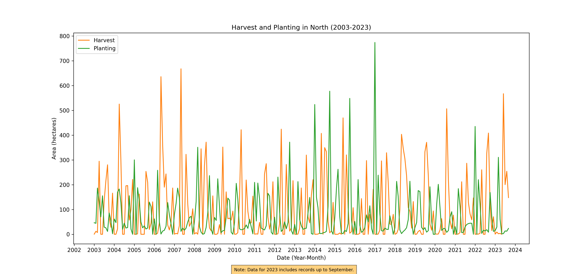

		**Figure 50.** Monthly Harvest and Planting, 2003-2023
		:::
		
		:::{tab-item} South
		:sync: key6
		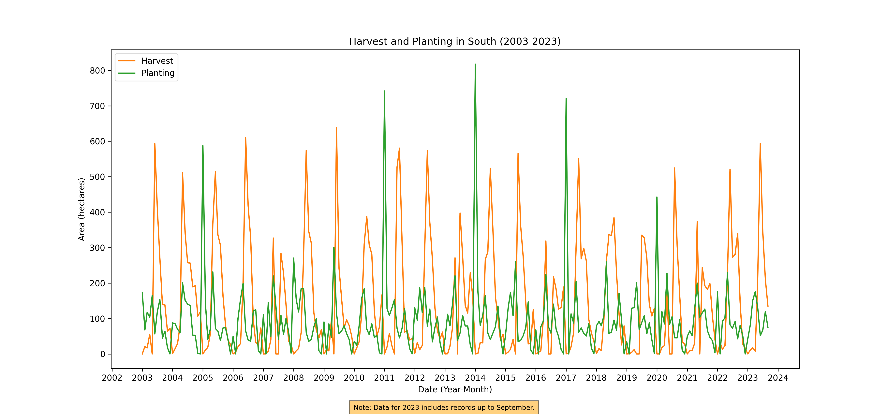

		**Figure 51.** Monthly Harvest and Planting, 2003-2023
		:::
		
		:::{tab-item} Akkar
		:sync: key7
		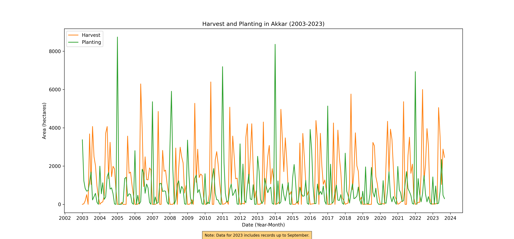

		**Figure 52.** Monthly Harvest and Planting, 2003-2023
		:::
		
		:::{tab-item} Baalbek-El Hermel
		:sync: key8
		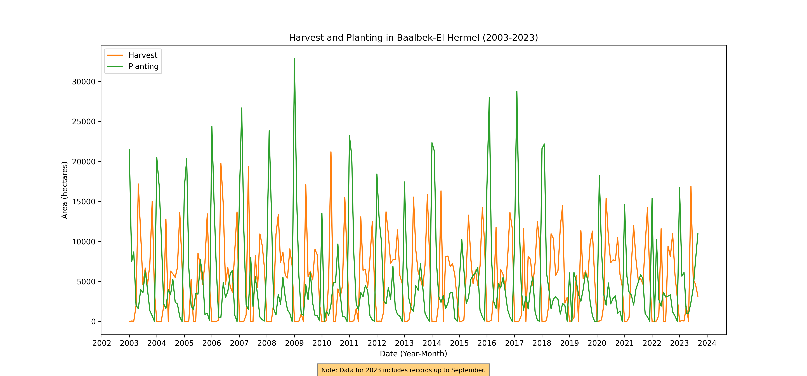

		**Figure 53.** Monthly Harvest and Planting, 2003-2023
		:::
		::::

**Correlation with Precipitation and Temperature:** By integrating climate data, specifically monthly and annual records of precipitation and temperature, the analysis draws connections between climatic conditions and agricultural activities. This aspect is crucial in understanding how changing weather patterns impact the timing and success of crop cycles.

* National aggregate

	::::{tab-set}
	:::{tab-item} Annual Rainfall and Temperature
	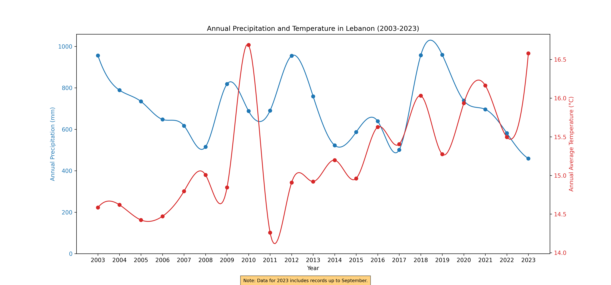

	**Figure 54.** Annual Rainfall and Temperature, 2003-2023
	:::

	:::{tab-item} Monthly Rainfall and Temperature
	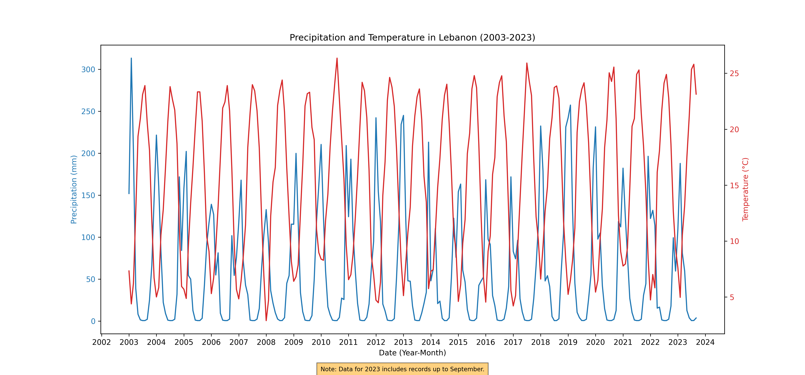

	**Figure 55.** Monthly Rainfall and Temperature, 2003-2023
	:::
	::::

* Governorate aggregate

	* Annual Rainfall and Temperature

		::::{tab-set}
		:::{tab-item} Beirut
		:sync: key1
		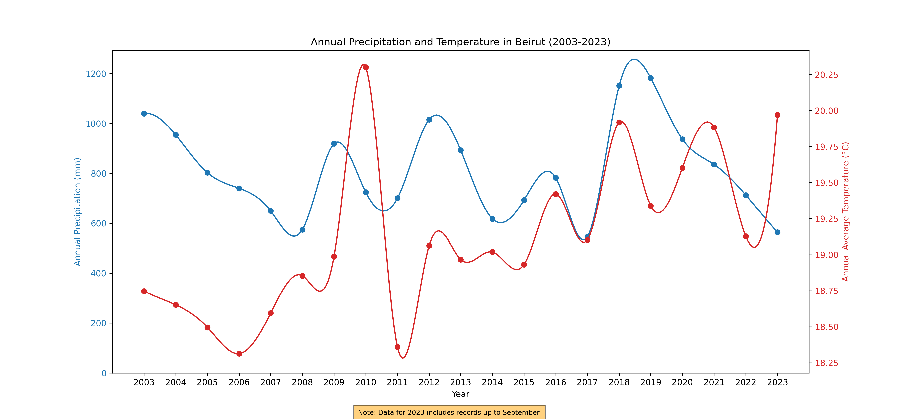

		**Figure 56.** Annual Rainfall and Temperature, 2003-2023
		:::

		:::{tab-item} Bekaa
		:sync: key2
		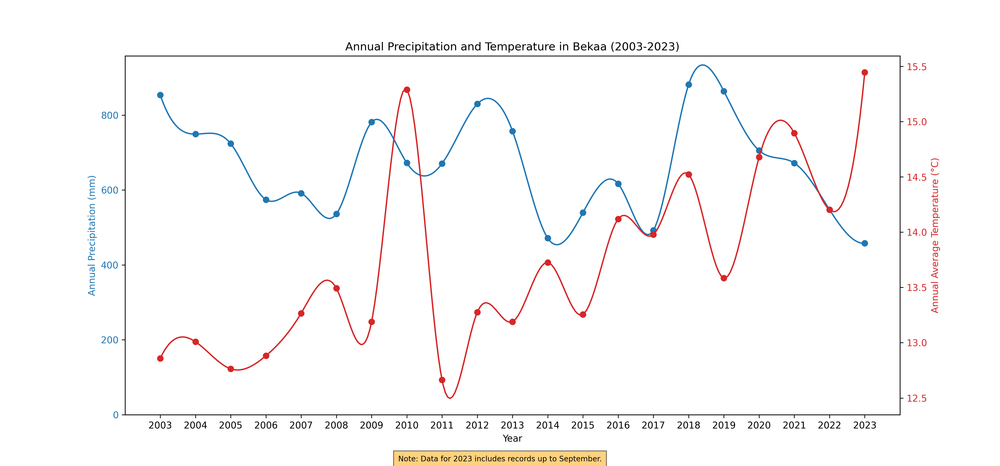

		**Figure 57.** Annual Rainfall and Temperature, 2003-2023
		:::

		:::{tab-item} Mount Lebanon
		:sync: key3
		

		**Figure 58.** Annual Rainfall and Temperature, 2003-2023
		:::

		:::{tab-item} El Nabatieh
		:sync: key4
		

		**Figure 59.** Annual Rainfall and Temperature, 2003-2023
		:::

		:::{tab-item} North
		:sync: key5
		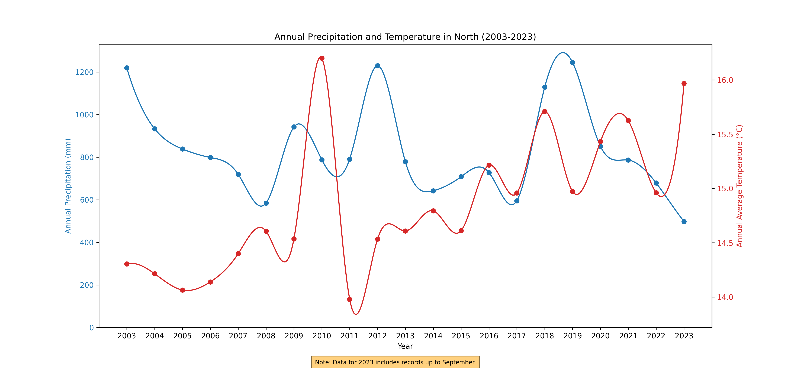

		**Figure 60.** Annual Rainfall and Temperature, 2003-2023
		:::

		:::{tab-item} South
		:sync: key6
		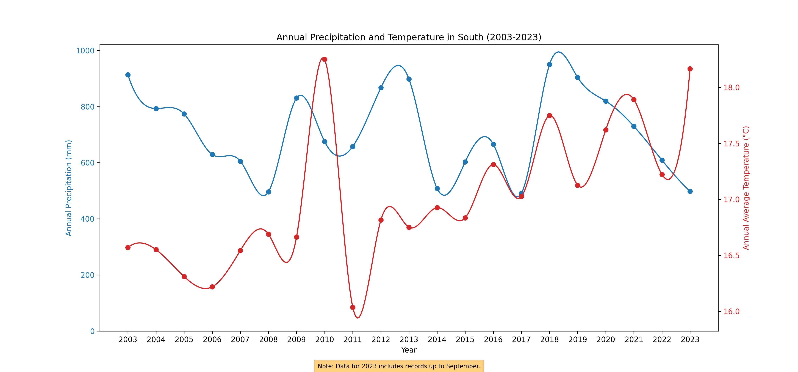

		**Figure 61.** Annual Rainfall and Temperature, 2003-2023
		:::

		:::{tab-item} Akkar
		:sync: key7
		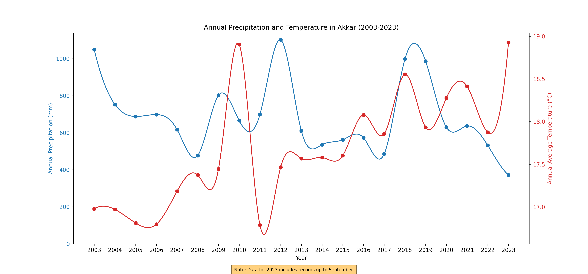

		**Figure 62.** Annual Rainfall and Temperature, 2003-2023
		:::

		:::{tab-item} Baalbek-El Hermel
		:sync: key8
		

		**Figure 63.** Annual Rainfall and Temperature, 2003-2023
		:::
		::::

	* Monthly Rainfall and Temperature

		::::{tab-set}
		:::{tab-item} Beirut
		:sync: key1
		

		**Figure 64.** Monthly Rainfall and Temperature, 2003-2023
		:::
		
		:::{tab-item} Bekaa
		:sync: key2
		

		**Figure 65.** Monthly Rainfall and Temperature, 2003-2023
		:::

		:::{tab-item} Mount Lebanon
		:sync: key3
		

		**Figure 66.** Monthly Rainfall and Temperature, 2003-2023
		:::

		:::{tab-item} El Nabatieh
		:sync: key4
		

		**Figure 67.** Monthly Rainfall and Temperature, 2003-2023
		:::

		:::{tab-item} North
		:sync: key5
		

		**Figure 68.** Monthly Rainfall and Temperature, 2003-2023
		:::

		:::{tab-item} South
		:sync: key6
		

		**Figure 69.** Monthly Rainfall and Temperature, 2003-2023
		:::

		:::{tab-item} Akkar
		:sync: key7
		

		**Figure 70.** Monthly Rainfall and Temperature, 2003-2023
		:::

		:::{tab-item} Baalbek-El Hermel
		:sync: key8
		

		**Figure 71.** Monthly Rainfall and Temperature, 2003-2023
		:::
		::::

### Planting and Harvesting Trends: National-Regional Perspectives and Anomalies

This section delves into the analysis of annual and monthly trends in planting and harvesting across Lebanon from 2003 to 2023. It employs a dual approach of bar plots and heatmaps to convey the nuances of agricultural activities over two decades.

**Annual Trends in Planting and Harvesting:** Bar plots are utilized to illustrate the year-on-year variations in planting and harvesting areas. These visual representations offer a clear, comparative view of the annual changes, highlighting any significant increases or decreases in agricultural activities.

::::{tab-set}
:::{tab-item} Lebanon
:sync: key1


**Figure 72.** Annual Harvest and Planting Anomaly, 2003-2023
:::

:::{tab-item} Beirut
:sync: key2


**Figure 73.** Annual Harvest and Planting Anomaly, 2003-2023
:::

:::{tab-item} Bekaa
:sync: key3


**Figure 74.** Annual Harvest and Planting Anomaly, 2003-2023
:::

:::{tab-item} Mount Lebanon
:sync: key4


**Figure 75.** Annual Harvest and Planting Anomaly, 2003-2023
:::

:::{tab-item} El Nabatieh
:sync: key5


**Figure 76.** Annual Harvest and Planting Anomaly, 2003-2023
:::

:::{tab-item} North
:sync: key6


**Figure 77.** Annual Harvest and Planting Anomaly, 2003-2023
:::

:::{tab-item} South
:sync: key7


**Figure 78.** Annual Harvest and Planting Anomaly, 2003-2023
:::

:::{tab-item} Akkar
:sync: key8


**Figure 79.** Annual Harvest and Planting Anomaly, 2003-2023
:::

:::{tab-item} Baalbek-El Hermel
:sync: key9


**Figure 80.** Annual Harvest and Planting Anomaly, 2003-2023
:::
::::

**Monthly Anomaly Heatmaps:** To capture the subtleties of monthly fluctuations, heatmaps are presented, showcasing the anomalies in planting and harvesting areas. These heatmaps provide a visual representation of the deviations from the average, making it easier to spot patterns, irregularities, or shifts in the agricultural calendar.

::::{tab-set}
:::{tab-item} Lebanon
:sync: key1


**Figure 81.** Monthly Harvest and Planting Anomaly, 2003-2023
:::

:::{tab-item} Beirut
:sync: key2


**Figure 82.** Monthly Harvest and Planting Anomaly, 2003-2023
:::

:::{tab-item} Bekaa
:sync: key3


**Figure 83.** Monthly Harvest and Planting Anomaly, 2003-2023
:::

:::{tab-item} Mount Lebanon
:sync: key4


**Figure 84.** Monthly Harvest and Planting Anomaly, 2003-2023
:::

:::{tab-item} El Nabatieh
:sync: key5


**Figure 85.** Monthly Harvest and Planting Anomaly, 2003-2023
:::

:::{tab-item} North
:sync: key6


**Figure 86.** Monthly Harvest and Planting Anomaly, 2003-2023
:::

:::{tab-item} South
:sync: key7


**Figure 87.** Monthly Harvest and Planting Anomaly, 2003-2023
:::

:::{tab-item} Akkar
:sync: key8


**Figure 88.** Monthly Harvest and Planting Anomaly, 2003-2023
:::

:::{tab-item} Baalbek-El Hermel
:sync: key9


**Figure 89.** Monthly Harvest and Planting Anomaly, 2003-2023
:::
::::

## Potential Application 

Above products provides an important starting point for continuous monitoring of the crop planting status. Continuous monitoring could inform the following assessments:

1. How many districts are behind in planting? If there is a delay in some districts, and is planting acceleration necessary?
2. How many hectares are available for the next season?
3. Is the current harvest enough for domestic consumption?

Decision makers also need phonological data to decide on resource allocation issues or policy design:

1. Planting potential for the next months: assigning the distribution of agricultural inputs.
2. Mobilization of extension workers to monitor and implement mitigation strategies: adjustment of irrigation system in anticipation of drought or flood, pest control of infestation/disease to avoid crop failure, reservoir readiness for planting season.
3. Preparation of policy recommendations: assess ongoing situation, harvest estimate, price protection.

This information is necessary for both policy makers, farmers, and other agricultural actors (cooperatives, rural businesses). Negative consequences can be anticipated months ahead and resources can be prioritized on areas with higher risk or greater potential.

## References

1. David B. Lobell, Gregory P. Asner,C limate and Management Contributions to Recent Trends in U.S. Agricultural Yields. Science 299,1032-1032(2003).https://doi.org/10.1126/science.1078475
2. Friedl, M. A., & Brodley, C. E. (1997). Decision tree classification of land cover from remotely sensed data. Remote Sensing of Environment, 61(3), 399–409. https://doi.org/10.1016/S0034-4257(97)00049-7
3. Turner, B. L., Skole, D., Sanderson, S., Fischer, G., Fresco, L., & Leemans, R. (1995). Land-Use and Land-Cover Change Science/Research Plan. IGBP Report No. 35, HDP Report No. 7. https://lcluc.umd.edu/sites/default/files/lcluc_documents/strategy-igbp-report35_0.pdf
4. Roy, D. P., Wulder, M. A., Loveland, T. R., C.E., W., Allen, R. G., Anderson, M. C., … Zhu, Z. (2014). Landsat-8: Science and product vision for terrestrial global change research. Remote Sensing of Environment, 145, 154–172. https://doi.org/10.1016/j.rse.2014.02.001
5. Jönsson, P., & Eklundh, L. (2004). TIMESAT—a program for analyzing time-series of satellite sensor data. Computers & Geosciences, 30(8), 833–845. https://doi.org/10.1016/j.cageo.2004.05.006